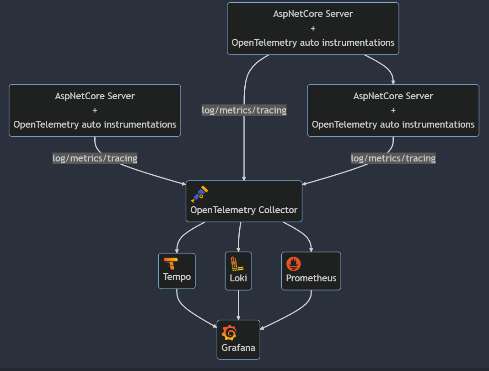

# dotnet observability lab

此份練習專案中的 .net server 都使用我另外一個專案 " [otel-dotnet-auto-instrumentation](https://github.com/YuChia-Wei/otel-dotnet-auto-instrumentation) " 所建立出來的 image，該專案目前已設定完成 alpine, bullseye-slim 兩個 OS 的 .net 6.0 / .net 7.0 的 image 發布，但是我尚未研究發佈 package 後的 image sign，不確定這會有什麼影響。如果你有安全性的顧慮，你可以 clone 該專案回去後，自行建立對應的 image base 後再進行此專案的建置與執行。

## architecture

## dotnet 6 dateOnly / timeOnly

🚨🚨🚨this is memo!🚨🚨🚨

🚩🚩🚩只有 .net 6 有這議題， .net 7 已內建支援🚩🚩🚩

- https://stackoverflow.com/questions/69187622/how-can-i-use-dateonly-timeonly-query-parameters-in-asp-net-core-6
- https://github.com/maxkoshevoi/DateOnlyTimeOnly.AspNet/tree/main
