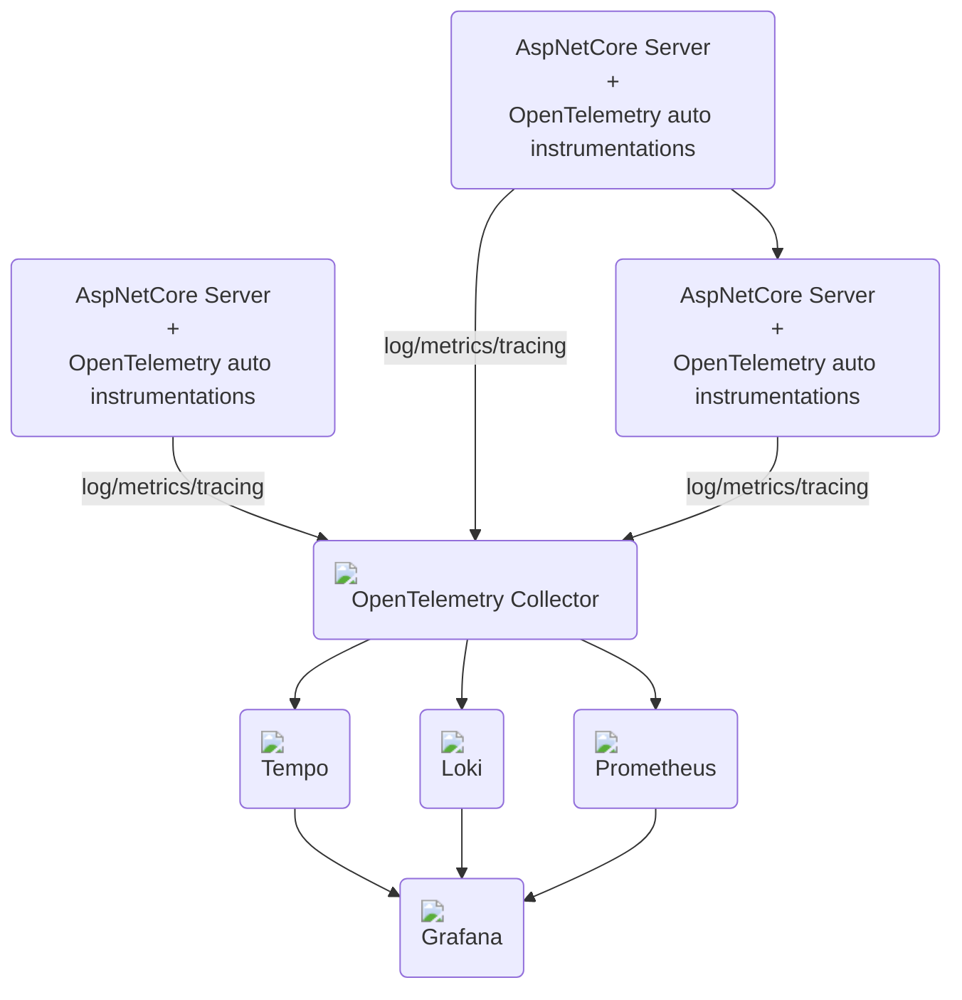

```mermaid
flowchart TB
    Service1("AspNetCore Server</br>+</br>OpenTelemetry auto instrumentations") --log/metrics/tracing--> OpenTelemetryCollector;
    Service2("AspNetCore Server</br>+</br>OpenTelemetry auto instrumentations") --log/metrics/tracing--> OpenTelemetryCollector;
    Service3("AspNetCore Server</br>+</br>OpenTelemetry auto instrumentations") --log/metrics/tracing--> OpenTelemetryCollector;
    Service2 --> Service3
    OpenTelemetryCollector(<img src='https://cncf-branding.netlify.app/img/projects/opentelemetry/icon/color/opentelemetry-icon-color.svg' width='30'>OpenTelemetry Collector) --> Tempo;
    OpenTelemetryCollector --> Loki;
    OpenTelemetryCollector --> Prometheus;
    Tempo(<img src='https://grafana.com/static/img/menu/grafana-tempo.svg' width='25'>Tempo) --> Grafana(<img src='https://grafana.com/static/img/menu/grafana2.svg' width='25'>Grafana);
    Loki(<img src='https://grafana.com/static/img/menu/loki.svg' width='25'>Loki) --> Grafana;
    Prometheus(<img src='https://cncf-branding.netlify.app/img/projects/prometheus/icon/color/prometheus-icon-color.svg' width='25'>Prometheus) --> Grafana;  
```